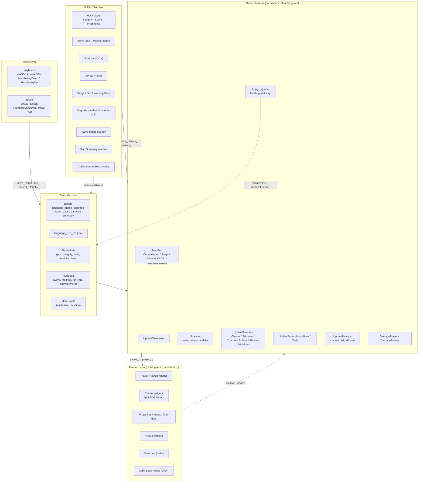

# Geometry Breakout / 几何突围 — System Architecture (Phase 1)

**Project:** Geometry Breakout / 几何突围
**Author:** 高见远 (Gao) — Architect, Software Company team (Qi / 齐活林, Delivery Director)
**Date:** 2026-08-03
**Stage:** Architect (immediately following PM / 许清楚 strategic plan)
**Audience:** Engineer (寇豆码) — this is the implementation contract for Phase 1 + Phase 2 data shapes
**Status:** Binding design — no code in this document, only architecture. Engineer implements against it.
**Engine reality:** TapTap Maker + Urhox Lua, UI-only (NanoVG + Yoga Flexbox), single-file `scripts/main.lua` (926 lines / 1500-line threshold = 62%), bilingual en + zh_CN, mobile-first.

---

## Table of Contents

1. [System Architecture Overview](#1-system-architecture-overview)
2. [File Split Plan (CRITICAL)](#2-file-split-plan-critical)
3. [Data Structures (Phase 1 + Phase 2 spec)](#3-data-structures-phase-1--phase-2-spec)
4. [Implementation Order & Build Checklist](#4-implementation-order--build-checklist)
5. [Open Questions for PM / User](#5-open-questions-for-pm--user)
6. [Appendix A — Lua require patterns in TapTap Maker](#appendix-a--lua-require-patterns-in-taptap-maker)
7. [Appendix B — Migration diff sketch](#appendix-b--migration-diff-sketch)

---

## 1. System Architecture Overview

### 1.1 High-level architecture

The game is a UI-only top-down arena loop. There is no Scene, no Viewport, no 3D rendering — every visible element is a `urhox-libs/UI` widget (a Yoga Flexbox panel rendered by NanoVG). The "game world" is one absolutely-positioned panel (`gameWorld_`) that hosts every moving entity widget (player, enemies, projectiles, mines, trail points, pickups). The HUD is a separate sibling panel. Both sit on a vertically-stacked root.



### 1.2 Module boundaries (Phase 1 scope)

For Phase 1 we **do not yet split files** (Section 2 explains why), but we **do organize the contents of `scripts/main.lua` into logical regions**. Each region becomes a future file when the split happens. The Engineer must respect region boundaries when adding Phase 1 code — do not interleave regions.

| Region | Current name in `main.lua` | Future file | Phase 1 additions |
|---|---|---|---|
| State + globals | top-level `local` declarations (lines 6–130) | `state.lua` | Splitter / Shooter / Spire / Resonance / Glitch state |
| Player State | `player_` table + `UpdateMovement` | `player.lua` | (no additions) |
| Inputs | `HandleTouchDown/Move/Up`, `keys_`, joystick | (stay in `state.lua` — too small to split) | (no additions) |
| Modifiers | `ModifierForWave`, Surge timer | (stay inside `waves.lua`) | add `Glitch` tick handler |
| Enemies | `SpawnEnemy`, `UpdateEnemies`, `EnemyKindForId`, `DamageEnemy` | `enemies.lua` (Phase 1: stay in `main.lua`; split in Phase 2) | Splitter, Shooter, Spire (mini-boss), Resonance Core (boss) |
| Pickups / XP / Level-up | `SpawnPickup`, `UpdatePickups`, `PrepareUpgradeChoices`, `ApplyUpgrade` | (stay in `main.lua` for Phase 1) | add new i18n keys |
| Projectiles + Mines + Trail | `FireTraceBeam`, `PlaceMine`, `UpdateMines`, `UpdateTrail`, `AddTrailPoint` | (stay in `main.lua`) | — |
| VFX layer (Phase 1 new) | n/a — add new region: `UpdateGlitchVisual`, `UpdateDamageNumbers`, `UpdateScreenShake` | keep inline for Phase 1; split when Phase 2 file split happens | all 4 cheap-feel layers |
| i18n + TEXT table | inline `TEXT.zh_CN` / `TEXT.en` + `T(key, ...)` | `i18n.lua` (Phase 2 split) | add ~30 new keys (see §3.1) |
| UI builders | `BuildLanguageScreen`, `BuildGameScreen`, `BuildUpgradeScreen`, `BuildWavePauseScreen`, `BuildArchiveScreen`, `BuildSummaryScreen`, `BuildUI` | `ui.lua` (Phase 2 split) | add Splitter / Shooter / boss Glitch visuals in `BuildGameScreen` |

### 1.3 Data flow (per frame)

```
HandleUpdate(timestep)
  │
  ├─ 1. State decay
  │     runTime_, waveTime_ += dt
  │     player_.invulnerable, fireTimer, pulseTimer, spawnTimer_, surgeFlash_ -= dt
  │
  ├─ 2. Modifier ticks
  │     if modifier == "surge"  → periodic pulse tick (deal 1 dmg to all enemies)
  │     if modifier == "glitch" → check phase-shift window, mark enemies for damage
  │
  ├─ 3. Input → Movement
  │     UpdateMovement(dt) → mutate player_.x, player_.y
  │
  ├─ 4. Wave pacing
  │     if waveSpawned_ < waveSpawnTarget_ and waveTime_ < waveDuration_:
  │       spawnTimer_ -= dt; when ≤ 0 → SpawnEnemy(...)
  │     if wave_ is boss wave: spawn boss entity instead of normal at scheduled time
  │
  ├─ 5. Module fire
  │     if "trace" active and fireTimer ≤ 0 → FireTraceBeam()
  │     if "pulse" active and pulseTimer ≤ 0 → PulseBloom()
  │     OrbitSeed tick → UpdateOrbit(dt)
  │     Shell tick → UpdateShell(dt) + UpdateShellVisual()
  │
  ├─ 6. Enemy tick
  │     UpdateEnemies(dt) → move chaser/skim/charge/split/shoot, collision with player
  │     Boss tick (separate function) → if boss is alive in enemies_, run boss state machine
  │
  ├─ 7. World entities tick
  │     UpdateProjectiles(dt)   (Trace Beam bolts + future Phase 2 Phase Lance)
  │     UpdatePickups(dt)       (magnet pull + pickup)
  │     UpdateMines(dt)         (place + arm + detonate)
  │     UpdateTrail(dt)         (Vector Hook dot drops)
  │
  ├─ 8. VFX layer (Phase 1 NEW)
  │     UpdateDamageNumbers(dt) (rise + fade)
  │     UpdateScreenShake(dt)   (camera offset decay)
  │     UpdateGlitchVisual(dt)  (brief screen-edge flash + chromatic offset)
  │
  ├─ 9. Wave-end check
  │     if waveTime_ ≥ waveDuration_ and waveSpawned_ ≥ waveSpawnTarget_ and #enemies_ == 0:
  │       EndWave() → either next wave_pause or summary
  │
  └─ 10. HUD update
        UpdateHUD() (label texts + bar fills)
```

This sequence is **critical contract for Phase 1** — the VFX layer (step 8) is new, and the boss tick must run **inside step 6** so that boss state can read `enemies_` after `UpdateEnemies` runs.

### 1.4 Render layer contract

Every entity in the game world is a child of `gameWorld_` (a `UI.Panel` with `position = "absolute", pointerEvents = "none"`). The render rule per frame is:

```
for each entity in {enemies_, projectiles_, pickups_, mines_, trail_}:
    SetWidgetPosition(entity.widget, entity.x, entity.y, entity.size)
    entity.widget:SetStyle({ backgroundColor = ..., scale = ..., opacity = ... })  -- when needed
```

**Phase 1 entities** that are new: Splitter, Shooter, Mini-boss Spire (3 shield arcs), Resonance Core (multi-segment core). Each must have its own widget created at spawn time and destroyed by `ClearEntities()` on run-end / restart.

**No widget ever leaks** between runs. The Engineer must add new entity widget destruction in `ClearEntities()` (currently lines 309–319 of `main.lua`).

---

## 2. File Split Plan (CRITICAL)

### 2.1 Current state vs target

| Aspect | Today | Target after split |
|---|---|---|
| Files | 1 (`scripts/main.lua`) | 6 (`scripts/main.lua` + 5 modules) |
| Lines per file | 926 (largest = this single file) | target ≤ 700 lines per file, ≤ 600 max |
| Largest single file budget | 1500 (AGENTS.md rule #13 hard limit) | 700 (self-imposed; we never want to come close to the hard limit again) |
| Single-module effort to add | 60–120 lines per Phase 2 module | 60–120 lines per file (same) |

### 2.2 Recommended split — hybrid (state + domain)

Reasoning: state is shared across every system and changes 1:1 with the run loop. Domain modules (player, enemies, etc.) have one clear owner each. UI builders are large but isolated. Util holds color/size constants centralized for the design-token pass in Phase 3.

```
scripts/
├── main.lua          — entry, SubscribeToEvent, language screen builder, top-level dispatch
├── state.lua         — global run state, modifier, profile, pickups, level/XP, i18n TEXT + T()
├── player.lua        — PlayerState table, UpdateMovement, ApplyUpgrade, ApplyChassisPassive
├── enemies.lua       — enemy factory table, UpdateEnemies, UpdateProjectiles, DamageEnemy, boss tick
├── modules.lua       — UpdateOrbit, UpdateShell, PulseBloom, PlaceMine, UpdateMines, UpdateTrail, FireTraceBeam
├── ui.lua            — BuildGameScreen, BuildUpgradeScreen, BuildWavePauseScreen, BuildArchiveScreen, BuildSummaryScreen, UpdateHUD, UpdateDamageNumbers, UpdateScreenShake, UpdateGlitchVisual
├── waves.lua         — modifier system (Compression / Surge / Overclock / Glitch), WaveSpawn table, BossSpawn entries
└── design.lua        — COLORS, SIZES, DURATIONS (Phase 1 stub; Phase 3 full pass)
```

Total after split: 8 files. Largest should be `ui.lua` (~550 lines after Phase 1) and `enemies.lua` (~480 lines after Phase 1 boss logic). **No file crosses 700.**

### 2.3 Per-file contract

#### `scripts/main.lua` — entry + glue

- **Responsibility:** `Start()`, `Stop()`, `HandleUpdate(eventType, eventData)`, `HandleKeyDown`, `HandleKeyUp`, `SubscribeToEvent` calls. Dispatch by screen (game / upgrade / wave_pause / archive / summary / language). Build the language-selection screen. Reset run state. Nothing else.
- **Line estimate:** ~150 lines after split (was 926).
- **Exports:** `Start`, `Stop`, `HandleUpdate`, `HandleKeyDown`, `HandleKeyUp` (UrhoX requires global functions for `SubscribeToEvent`)
- **Imports:** `state` (for `screen_`, run-state mutation), `ui` (for `BuildUI`)
- **Critical:** must NOT duplicate any logic. Pure orchestration.

#### `scripts/state.lua` — runtime state containers

- **Responsibility:** All `local` runtime state (player_, enemies_, projectiles_, pickups_, mines_, trail_, moduleLevels_, activeModules_, modifier_, wave_, level_, score_, profile_, etc.). i18n `TEXT` table + `T(key, ...)` lookup. World-size query. Modifier-cycle function.
- **Line estimate:** ~250 lines (includes the inline `TEXT` table).
- **Exports:** table with field getters/setters OR a Lua module pattern (see §2.5). Engineer prefers the module pattern (cleaner).
- **Imports:** `UI` (only for `ClearEntities` indirectly — actually keep `ClearEntities` here since it operates on state).
- **Note:** `TEXT` table moves here in Phase 1 (only) to centralize i18n pre-Phase-3 refactor. JSON-mirrored file (`i18n/en.json`, `i18n/zh_CN.json`) stays untouched.

#### `scripts/player.lua`

- **Responsibility:** `PlayerState` factory, `UpdateMovement`, `DamagePlayer`, Shell ring visual (was inline `UpdateShellVisual`). Apply chassis passive (Phase 2 placeholder for Vector Triangle).
- **Line estimate:** ~150 lines for Phase 1.
- **Exports:** `state.player`, `state.update_movement(dt, input, world)`, `state.damage_player(amount, source)`.
- **Imports:** `state` (for shared globals), `UI` (for shell ring widget).

#### `scripts/enemies.lua`

- **Responsibility:** Enemy factory tables (one entry per `kind` including `splitter`, `shooter`, `boss_spire`, `boss_resonance`), `SpawnEnemy`, `UpdateEnemies`, `UpdateProjectiles` (kept here because projectile-vs-enemy collision is enemy logic), `DamageEnemy`, `FindNearestEnemy`, boss tick dispatcher.
- **Line estimate:** ~480 lines for Phase 1 (boss state machines for Spire + Resonance Core are 100+ lines combined).
- **Exports:** `enemies.spawn(kind, x, y, opts)`, `enemies.update(dt)`, `enemies.damage(e, amount)`, `enemies.find_nearest(pos)`, `enemies.update_boss(dt)`.
- **Imports:** `state` (for shared lists, `player_`, `modifier_`), `UI` (for widgets), `modules` (for boss phase-2 summoning — see `enemies.lua` §3.1).
- **Critical: NO circular import.** Enemies → state (read only); enemies → modules (for summon utilities). Reverse direction forbidden.

#### `scripts/modules.lua`

- **Responsibility:** All six current modules + any future simultaneous module: `FireTraceBeam`, `PulseBloom`, `UpdateOrbit`, `UpdateShell`, `UpdateShellVisual` (move here from `player.lua` for tight coupling), `PlaceMine`, `UpdateMines`, `AddTrailPoint`, `UpdateTrail`. Future Phase 2 modules mount here.
- **Line estimate:** ~360 lines for Phase 1.
- **Exports:** `modules.update_all(dt)` (one call per frame replaces the 6 individual updates currently in `HandleUpdate`), plus per-module helpers if testing needs them.
- **Imports:** `state` (read player_, enemies_, projectiles_, mines_, trail_), `UI`.

#### `scripts/ui.lua`

- **Responsibility:** All `Build*Screen` functions (game, upgrade, wave_pause, archive, summary, language — language can stay in `main.lua` since it's only 1 panel). `BuildUI` dispatcher. `UpdateHUD`, `UpdateDamageNumbers`, `UpdateScreenShake`, `UpdateGlitchVisual`.
- **Line estimate:** ~550 lines for Phase 1 (largest file).
- **Exports:** `ui.build(screen)`, `ui.update_hud()`, `ui.update_vfx(dt)`.
- **Imports:** `state` (read run state for labels), `UI`.

#### `scripts/waves.lua`

- **Responsibility:** `WaveDefinition` table for waves 1–8, modifier cycle, `SpawnEnemy` policy (which kind for which wave), `WaveEndCheck`, boss spawn timing.
- **Line estimate:** ~120 lines for Phase 1.
- **Exports:** `waves.spawn_for_wave(wave, t_in_wave)`, `waves.modifier_for(wave)`, `waves.boss_timer(wave)`.
- **Imports:** `state`, `enemies` (for `spawn`).

#### `scripts/design.lua` — Phase 1 stub

- **Responsibility (Phase 3):** Centralize color hex / size / duration constants. Phase 1 ships **empty stub** with one comment: `-- Phase 3 design-token pass will populate COLORS and SIZES tables here.`
- **Line estimate:** ~15 lines for Phase 1.

### 2.4 Lua require pattern for TapTap Maker

**Confirmed via `examples/07-minecraft-voxel-world/main.lua` and `examples/22-third-person-shooter/main.lua`:** the UrhoX Lua runtime resolves `require("Foo")` against `scripts/` as a resource root. Subdirectories use dot notation: `require("config.GameConfig")` resolves to `scripts/config/GameConfig.lua`.

**Files in `scripts/` root:** `require("state")` resolves to `scripts/state.lua`.

**Recommended module shape (from `examples/` convention):**

```lua
-- scripts/state.lua
local M = {}

M.screen_ = "language"
M.language_ = "zh_CN"
M.player_ = { x = 0, y = 0, ... }
M.enemies_ = {}
-- ... all the existing module-level locals become M.* fields

function M.T(key, ...)
    -- unchanged
end

function M.clear_entities()
    -- unchanged from current ClearEntities
end

return M
```

Consumers then write `local state = require("state")` and access `state.player_`, `state.T(...)`, etc.

**Caveat:** The current `main.lua` uses `local` for every top-level — that's the *isolated* pattern. The *shared-state* pattern (above) requires careful discipline: every mutation goes through the module. Engineer must enforce this.

**Critical:** `Text` table sits in `state.lua`. Every `T("...")` call inside `player.lua`, `enemies.lua`, etc. imports `state` and calls `state.T(...)`. The compiler / LSP will flag unresolved imports.

### 2.5 Migration path — the order

This is the **single biggest risk** in the refactor. Do not combine the file split with Phase 1 feature work. Do it in stages, each git-green.

#### Step 1: Stub + extract `i18n` (safe, ~60 lines moved)

- Create `scripts/state.lua` containing only the `TEXT` table and `T(key, ...)` function. Re-export the originals from `main.lua`. Both `scripts/state.lua` and `scripts/main.lua` export `T` — for now `main.lua`'s `T` is the one referenced everywhere. `state.lua.T` is a forward-compatibility stub.
- Verify: build, run, language switching still works. No behavior change.

#### Step 2: Extract player + module collection (medium risk, ~210 lines moved)

- Create `scripts/player.lua` with `player_` table + `UpdateMovement` + `DamagePlayer`.
- Create `scripts/modules.lua` with the 6 existing module update functions + `FireTraceBeam` + `PulseBloom`.
- In `main.lua`, `require` them at top. The shared state goes through a **single globals table** in `state.lua` (state is a module loaded first; player and modules write into `state.player_`, `state.moduleLevels_`, etc.).
- **The hairy part:** `FireTraceBeam` reads `state.enemies_` (find nearest) and mutates `state.projectiles_`. This is read/write to shared module state — acceptable but Engineer must NOT cache references, always go through `state.X`.
- Verify: build, run a full 6-wave run, confirm identical behavior to pre-split.

#### Step 3: Extract enemies (medium risk, ~250 lines moved)

- `scripts/enemies.lua` with `enemies_`, `projectiles_` (since projectiles only collide with enemies — they belong to this module), `SpawnEnemy`, `UpdateEnemies`, `UpdateProjectiles`, `DamageEnemy`, `FindNearestEnemy`.
- `state.lua` still owns `enemies_` and `projectiles_` *tables* (the array is shared). `enemies.lua` provides the *API*.
- Verify: same end-to-end behavior.

#### Step 4: Extract UI builders (low risk, ~350 lines moved)

- `scripts/ui.lua` with all `Build*Screen` + `UpdateHUD` + new `UpdateDamageNumbers` + `UpdateScreenShake` + `UpdateGlitchVisual`.
- `state.lua` exposes `BuildUI` dispatcher that calls into `ui.build(screen)`.
- Verify: every screen builds and rebuilds correctly. Run-end → summary works.

#### Step 5: Extract waves (lowest risk)

- `scripts/waves.lua` defines the wave table and modifier cycle.
- Verify: same wave pacing.

**Critical rule: do NOT add Phase 1 features during Steps 1–5.** Each step must result in identical in-game behavior to the previous step. Only after Step 5 is green do we add Splitter / Shooter / boss / Glitch. This is a hard gate.

### 2.6 Trigger condition — when to split

**The split MUST begin now, before any Phase 1 feature is added.** Reasons:

1. Phase 1 adds roughly 350–500 lines (Splitter ≈ 60, Shooter ≈ 70, Spire ≈ 120, Resonance Core ≈ 180, Glitch ≈ 60, damage-numbers/shake/glitch-flash VFX ≈ 100). Adding these on top of the 926-line current file pushes us to ~1300–1500 — right at or past the AGENTS.md #13 hard limit, and past our self-imposed 700-line soft limit per file *if we were already split*.
2. Each Phase 2 module adds 60–120 lines. Without a split, the file will reach 1500 mid-Phase 2 and force a split at the worst possible time (mid-feature).
3. Now is the *cheapest* time to split: no behavior is changing, just relocation. Adding behavior during relocation is a recipe for unmaskable regressions.

**Trigger point:** **Now.** Do not wait for a line threshold.

### 2.7 What the Engineer should NOT do

- Do not bundle the split with new features.
- Do not introduce a class system (no `_class.lua` / metatables). Use plain tables — this codebase's style.
- Do not invent new module-isolation helpers. Use the `local M = {}; ... return M` pattern from `examples/`.
- Do not change `urhox-libs/` (read-only).
- Do not refactor `MakeLabel`, `SetWidgetPosition`, `MakeLanguageButton`, `Color`, or the `TEXT` table's structure during the split. Mechanical move-only.

---

## 3. Data Structures (Phase 1 + Phase 2 spec)

All schemas below are **Lua pseudocode** the Engineer can transcribe into plain Lua tables. No metatables unless explicitly noted. All field names match the existing convention (`x`, `y`, `vx`, `vy`, `kind`, `phase`, `telegraph`).

### 3.1 Phase 1 — new enemy types (2 new + 1 boss)

> **PM design intent:** Splitter (splits into 2 on death, AOE-favored counter) + Shooter (stationary ranged, force movement) + Resonance Core wave-8 boss (3 phases). The PM plan keeps the existing mini-boss Spire sketch for Phase 1 only as the wave-3 encounter.

#### 3.1.1 Splitter (Phase 1 — first deliverable, by Friday 2026-08-08)

```lua
-- Entry: enemies[{ id, x, y, kind = "splitter", ... }]
splitter = {
    x = 0, y = 0,
    vx = 0, vy = 0,                       -- unused (no projectile), reserved for uniform API
    radius = 12,                          -- half-size for collision (24-pixel body)
    speed = 84 + wave_ * 3,               -- slightly faster than Chaser (52) — split on death is the threat
    integrity = 4 + wave_,                -- base 4 HP + per-wave scaling; ~2x Chaser HP
    widget = <UI.Panel>,                  -- cyan diamond with vertical split-line that flashes on hit
    elite = false,
    kind = "splitter",
    phase = 0,                            -- accumulator for animation breathing
    charge = 0,                           -- unused
    telegraph = 0,                        -- unused (Splitter has no charged attack)
    dead = false,
    splitEmitted = false,                 -- CRITICAL: guard so split happens exactly once on death
}
```

**Spawn rules:**

- Appears in wave-3+ spawn pool (per PM plan §I.4).
- Spawn rate: 1 per 4 normal spawns in waves 3–5; 1 per 2 spawns in waves 6+.
- Position: same 4-side random edge as existing enemies (`SpawnEnemy` already implements this).
- Max simultaneous Splitters: 6 (constraint — prevents runaway split recursion).

**Behavior — finite-state machine:**

```
state = "chase" (default, until killed)
  ↳ per-frame: dx,dy = (player - self); move toward player at self.speed.
                (no animation differentiator from Chaser; the visual split-line IS the tell)

on DamageEnemy(splitter, dmg):
    self.integrity -= dmg
    if self.integrity <= 0 and not self.splitEmitted:
        self.splitEmitted = true
        spawn 2x splitter_mini at (self.x ± 6, self.y ± 6)
        spawn 2x data pickup (×1 each) at (self.x, self.y)
        spawn 1x shard pickup (×1) at (self.x, self.y)
        self.dead = true
```

**Splitter-Mini (special, exists only via Splitter death):**

```lua
splitter_mini = inherits splitter with overrides {
    radius = 8,
    speed = 110 + wave_ * 3,
    integrity = 2 + wave_ * 0.6,        -- 60% of parent HP (per PM §I.4)
    damage_on_contact = 0.7 * base,     -- 70% of parent's contact damage (per PM §I.4)
    splitEmitted = true,                -- mini-mini are NOT a thing; prevent recursive cascade
    widget = <UI.Panel smaller, same cyan>
}
```

**Damage / HP balance:**

- Splitter base HP: **4 + wave_** (so wave-3 Splitter = 7 HP). With Pulse Bloom Lv3 ticking at 5 dmg every 2.05s the player kills a wave-3 Splitter in ~1.4s. Trace Beam at level 1 fires every 0.38s for 2 dmg → kills in 3–4 beams.
- Mini HP: **2 + wave_ * 0.6**. Wave-3 mini = 3.8 HP. Each mini drops 1 data + 1 shard on death for economy continuity.
- Total reward economy per Splitter kill (1 parent → 2 minis → 3 total entities): **3 data + 3 shards** vs **1 data + 1 shard** for a Chaser. Slight reward bias to offset the difficulty multiplier (Spltiter splits into 2 new threats).

**Telegraph + visual:**

- Split-line: a thin white vertical bar (1px wide × full body height, `backgroundColor = {255, 255, 255, 180}`) inside the Splitter widget, drawn via a sibling absolutely-positioned `UI.Panel`. Flashes for 0.12s on each hit (`opacity = 1` then decay).
- Mini-Splitter: same widget at 0.7× scale (`SetStyle({ scale = 0.7 })`).
- No charge telegraph (it's a passive chaser).

**i18n keys to add (both `en.json` and `zh_CN.json`):**

| Key | English | 中文 |
|---|---|---|
| `enemy.splitter` | `Splitter` | 裂核体 |
| `enemy.splitter_desc` | `Splits into two smaller forms on defeat` | 阵亡时分裂为两个更小的形态 |
| `enemy.splitter_mini` | `Splitter Shard` | 裂核残片 |

#### 3.1.2 Shooter (Phase 1 — second enemy)

**Recommended naming:** keep "Shooter" (matches PM Appendix I.5) but the in-game display name should be distinct from "Shooter" to avoid generic-feel. Suggest `Phase Lance` visual silhouette — a static triangular cannon that fires telegraphed bolts. See PM §I.5. For the purpose of *this* document, the data shape is:

```lua
shooter = {
    x = 0, y = 0,
    vx = 0, vy = 0,
    radius = 14,                          -- larger than Chaser (fatter body)
    speed = 0,                            -- STATIONARY. Movement is zero.
    integrity = 3 + wave_ * 0.8,          -- fragile (3 base HP at wave 1; ~9 at wave 8)
    widget = <UI.Panel>,                  -- magenta triangle with glowing red eye (telegraph indicator)
    elite = false,
    kind = "shooter",
    phase = 0,
    charge = 0,                           -- accumulator for shot cooldown (2.0s between shots)
    telegraph = 0,                        -- shot wind-up timer (1.0s)
    telegraph_target_x = 0,               -- locked target position when telegraphing
    telegraph_target_y = 0,
    fireCooldown = 2.0,                   -- base 2.0s between shots (PM §I.5)
    dead = false,
}
```

**Spawn rules:**

- Appears in wave-4+ spawn pool (PM §K.1 places first Shooter at wave 4).
- Spawn rate: 1 per 6 normal spawns in waves 4–5; 1 per 4 in waves 6–8.
- Position: random within arena (NOT just edges). Spawns at `random 80..worldWidth_-80, random 80..worldHeight_-80`.
- Max simultaneous: 4 (prevents projectile-spam).
- Always faces the player at spawn time (cosmetic visual only).

**Behavior — finite-state machine:**

```
states = { "idle" (default), "telegraph", "fire", "cooldown" }

on spawn:
    self.state = "idle"

per-frame update:
    if self.state == "idle":
        self.telegraph = self.telegraph - dt
        if self.telegraph <= 0:
            self.state = "telegraph"
            self.telegraph = 1.0                        -- 1.0s wind-up (PM §I.5)
            self.telegraph_target_x, _ = player_.x
            self.telegraph_target_y, _ = player_.y     -- lock target at start of wind-up

    if self.state == "telegraph":
        -- visual: eye glows red, scale → 1.15
        self.telegraph = self.telegraph - dt
        if self.telegraph <= 0:
            self.state = "fire"

    if self.state == "fire":
        spawn 1 projectile at (self.x, self.y), aimed at locked target
            projectile.vx, projectile.vy = unit(self.telegraph_target - self) * 5  -- speed 5 (PM §I.5)
            projectile.damage = 6
            projectile.life = 2.5
            projectile.widget = <UI.Panel: small magenta diamond>
        self.state = "cooldown"
        self.charge = self.fireCooldown

    if self.state == "cooldown":
        self.charge = self.charge - dt
        if self.charge <= 0:
            self.state = "idle"
            self.telegraph = random(0.5, 1.5)          -- small randomness to de-sync

(shots do not track the player once fired — they fly toward the locked position)
```

**Damage / HP balance:**

- Shooter HP: 3 + wave_ * 0.8 → wave-4 Shooter = 6.2 HP.
- Player Trace Beam Lv1 = 2 dmg every 0.38s → kills in 3 beams (~1.1s).
- Shooter projectile damage: **6**. With Integrity = 5 base (no upgrades) the player dies in **1 hit**. Designer intent: forcing movement — staying still in a wave with Shooters is suicide. This is correct.
- Cooldown 2.0s — aligned with PM §I.5.
- Bullet speed: 5 (PM §I.5). At a 400-px arena and player speed 220 px/s, a fleeing player has ~1.5s to dodge after telegraph ends — comfortable.

**Telegraph + visual:**

- Idle: small magenta triangle (~24px), no glow.
- Telegraph (1.0s): eye glows red (`inner widget borderColor = {255, 60, 60, alpha}`), scale 1.15×.
- Fire: instant, eye returns to default.
- Cooldown: just idle.

**Visual widget composition (2 widgets):**

- Outer triangle (body).
- Inner circle (eye): 4px radius, child of outer, `position = "absolute", top = 8, left = 8, width = 8, height = 8, backgroundColor = {255, 60, 60, ...}`.

**Projectile (separate from player projectiles):**

```lua
shooter_projectile = {
    x = 0, y = 0,
    vx = 0, vy = 0,
    radius = 4,
    damage = 6,
    life = 2.5,
    pierce = 1,                                       -- disappear on first player hit
    widget = <UI.Panel: small magenta diamond>,
    source = "shooter",                               -- distinguishes from player projectiles
}
```

**i18n keys to add:**

| Key | English | 中文 |
|---|---|---|
| `enemy.shooter` | `Phase Lance` | 固相矛塔 |
| `enemy.shooter_desc` | `Stationary cannon that locks and fires` | 锁定目标后释放相位矛的静态炮塔 |

#### 3.1.3 Multi-stage boss — Resonance Core (Phase 1 — wave 8 final boss)

This replaces the existing wave-3 "elite = bigger Chaser." Per PM §J.2: 3 phases, ~2400 HP total, cycles 1→2→3→1→2→3 until dead. Each phase 15s by default but exits when HP threshold reached.

```lua
resonance_core = {
    x = <world center>,
    y = <world center>,
    vx = 0, vy = 0,
    radius = 28,                                          -- larger hitbox; phases transition visual scale briefly
    speed = 60,                                           -- phase 1 chases at 60 (PM §J.2)
    integrity = 2400,                                     -- per PM §J.2; we may retune to 1800 if too tanky
    widget = <UI.Panel multi-segment: 3 nested widgets — core, mid-ring, outer-ring>,
    elite = false,                                        -- boss is NOT tagged elite (separate code path)
    kind = "boss_resonance",
    phase = 1,                                            -- 1, 2, or 3
    phaseTimer = 0,                                       -- seconds in current phase
    phaseDuration = 15,                                   -- per PM §J.2
    cooldown = 0,                                         -- phase 1 dash cooldown (5s)
    telegraph = 0,                                        -- phase 1 dash wind-up (1.0s) / phase 3 beam rotation accumulator
    sweepAngle = 0,                                       -- phase 3 beam-sweep angle accumulator
    dashDirX = 0, dashDirY = 0,                           -- last dash direction
    summoningCooldown = 0,                                -- phase 2 summon timer (8s)
    contactDamage = 14,                                   -- phase 1 contact
    dashDamage = 22,                                      -- phase 1 dash hit
    dead = false,
    cycleCount = 0,                                       -- how many full 1→2→3 cycles have completed
    maxCycles = 3,                                        -- per PM §J.2: 3 cycles to deplete HP
}

-- When phase changes, run a 0.4s "transition flash" — see UpdateGlitchVisual / bossVfxLayer
```

**Phase state machine:**

```
state = "phase_1" (default on spawn)

on EnterPhase(newPhase):
    self.phase = newPhase
    self.phaseTimer = 0
    self.contactDamage, self.speed = contactDamageTable[newPhase], speedTable[newPhase]
    trigger 0.4s full-screen flash (gold for phase 1, magenta for phase 2, cyan for phase 3)
    -- also shift widget color: phase 1 = gold, phase 2 = magenta, phase 3 = cyan

per-frame update (in enemies.lua UpdateEnemies or a dedicated UpdateBoss):
    self.phaseTimer += dt

    if self.phase == 1:
        -- CHASE: move toward player at self.speed
        -- every 5s: enter dash telegraph (1.0s), then dash 12 units at 3× speed
        if self.cooldown <= 0:
            self.cooldown = 5
            self.telegraph = 1.0
            -- lock dash direction toward player at telegraph start
            self.dashDirX, self.dashDirY = unit(player - self)
        if self.telegraph > 0:
            self.telegraph = self.telegraph - dt
            -- visual: outer-ring flashes gold-red, scale 1.15×, alpha pulse
        elif self.cooldown > 4.0:    -- in dash window (last 1s of 5s cooldown)
            self.x = self.x + self.dashDirX * self.speed * 3 * dt
            self.y = self.y + self.dashDirY * self.speed * 3 * dt
            -- check collision with player during dash → dashDamage
        else:
            self.cooldown -= dt
            self.x, self.y = move_toward(self, player, self.speed * dt)

    if self.phase == 2:
        -- SUMMON: stationary. Every 8s spawn 3 Splitters + 1 Shooter at random arena edges.
        if self.summoningCooldown <= 0:
            self.summoningCooldown = 8
            spawn 3 splitter at random edges (using SpawnEnemy route but with kind = "splitter")
            spawn 1 shooter at random interior (using Shooter factory)
        self.summoningCooldown -= dt

    if self.phase == 3:
        -- BEAM-SWEEP: stationary. Fires a laser toward player at phase start, sweeps 180° over 8s.
        -- Laser is a thin panel anchored at boss position, rotating self.sweepAngle.
        self.sweepAngle += (180 / 8) * dt              -- degrees per second over 8s
        local beamTipX = self.x + math.cos(rad(self.sweepAngle)) * 600
        local beamTipY = self.y + math.sin(rad(self.sweepAngle)) * 600
        -- check collision: any enemy (player) within 30px of line (self.x,self.y)→(beamTipX,beamTipY) → 30 dmg per 0.5s tick
        -- visual: thin cyan line widget, updated each frame

    -- phase transition
    self.phaseTimer = self.phaseTimer + dt
    if self.phaseTimer >= self.phaseDuration:
        next = (self.phase % 3) + 1                   -- 1→2→3→1
        EnterPhase(next)
        if next == 1: self.cycleCount = self.cycleCount + 1
        if self.cycleCount >= self.maxCycles and self.phase == 1:
            -- Final phase 1 of last cycle: boss enters rage mode (Phase 1+ with +30% speed, +30% damage)
            self.speed = self.speed * 1.3
            self.contactDamage = self.contactDamage * 1.3
```

**Telegraph per attack:**

| Attack | Telegraph | Visual |
|---|---|---|
| Phase 1 chase | None — perpetual chase | gold ring around boss |
| Phase 1 dash | 1.0s wind-up (gold→red pulse, scale 1.0→1.2→dash) | outer ring strobes |
| Phase 2 summon | 0.6s warning flash before each spawn wave | boss color → bright magenta briefly |
| Phase 3 beam | 0.8s charge (cyan ring fills), then sweep starts | beam-line grows from 0 length to full |
| Phase transition | 0.4s full-screen flash | gold/magenta/cyan flash for phase 1/2/3 respectively |

**Reward (PM §J.2):**

- On defeat: +200 XP, +50 Data Fragments, +1 guaranteed module-evolution (any 1 active module gains +1 level up to Lv5 max).
- Cosmetic banner placed on run summary: "Resonance Core vanquished."
- Calibration Credits awarded (Phase 2 / Phase 4 meta currency — for Phase 1, simply increment a `bossesDefeated` counter in `profile_`).

**i18n keys to add:**

| Key | English | 中文 |
|---|---|---|
| `enemy.boss_resonance` | `Resonance Core` | 共振核心 |
| `enemy.boss_resonance_desc` | `Tri-phase final encounter of each run` | 每局的三相终结战 |
| `enemy.boss_phase_1` | `Phase I · Chase` | 第一相 · 追击 |
| `enemy.boss_phase_2` | `Phase II · Summon` | 第二相 · 召唤 |
| `enemy.boss_phase_3` | `Phase III · Beam Sweep` | 第三相 · 光束扫射 |

**Mini-boss Spire (wave 3) — short form (PM §J.1):**

The PM plan also specifies a wave-3 mini-boss (Spire: 600 HP, rotating shield segments with 90° gap, 50% HP shield-speed-up + arc fire). For Phase 1, recommended scope:

```lua
spire = {
    x = <center>,
    y = <center>,
    radius = 32,
    speed = 0,                                          -- stationary
    integrity = 600,
    widget = <UI.Panel: gold triangular core>,
    kind = "boss_spire",
    shieldAngle = 0,                                    -- rotation accumulator
    shieldSpeed = 2 * math.pi / 10,                     -- 10s per revolution (PM §J.1)
    arcCooldown = 0,                                    -- phase-2 arc fire timer
    dead = false,
}
```

Three shield arcs (each 90° of arc, separated by 30° gaps) are 3 child widgets of `spire.widget`. They rotate by updating each child's `rotate` property per frame. Damage logic: beam hits in the gap → boss takes damage; hits on shield → 0 damage (with visible "blocked" flash).

**If Phase 1 scope pressure forces a choice, ship Splitter + Shooter + Resonance Core and defer Spire to Phase 2.** Both bosses together is the worst-case for Engineer time. One boss + two new enemies is the recommended minimum for Phase 1's "first true boss + content density" promise.

### 3.2 Phase 1 — 4th modifier "Glitch"

**Designer intent (PM §6 Phase 1 deliverable #6):** every 8s, for ~3s, the player phase-shifts to intangible. Any enemy overlapping the player during the window takes damage. This is a *passive offense* modifier that flips the arena's interaction model.

#### 3.2.1 Schema

```lua
-- state.lua additions (for Phase 1)
state.glitchActive_ = false          -- is the phase-shift window currently open?
state.glitchTimer_ = 0              -- accumulator within current state
state.glitchPeriod_ = 8.0           -- seconds between activations (PM §6 #6)
state.glitchDuration_ = 3.0         -- seconds the window stays open
state.glitchDamage_ = 4             -- damage dealt on overlap (per second? per frame? — see below)

-- visuals (state for any tracking)
state.glitchEffectEnemies_ = {}     -- list of enemy IDs that took overlap damage this window
state.glitchChromaticFlash_ = 0     -- 0..1 screen-edge chromatic-aberration strength
state.glitchScreenFlash_ = 0        -- 0..1 brief white flash on activation
```

#### 3.2.2 Per-frame update logic (in `HandleUpdate`, step 2 modifier ticks)

```
each frame:
    if modifier_ == "glitch":
        state.glitchTimer_ = state.glitchTimer_ + dt

        if not state.glitchActive_ and state.glitchTimer_ >= state.glitchPeriod_:
            -- PHASE-SHIFT WINDOW OPENS
            state.glitchActive_ = true
            state.glitchTimer_ = 0
            state.glitchScreenFlash_ = 1.0
            player_.invulnerable = state.glitchDuration_    -- mutually exclusive with normal i-frames? — overlap allowed, this just extends i-frames to 3s
            feedbackLabel_:SetText(T("modifier.glitch_open"))
            feedbackLabel_:SetStyle({ opacity = 1, fontColor = { 130, 255, 255, 255 } })
            -- optional: brief cyan glow on player widget (backgroundColor cyan for the duration)

        if state.glitchActive_ and state.glitchTimer_ >= state.glitchDuration_:
            -- WINDOW CLOSES
            state.glitchActive_ = false
            state.glitchTimer_ = 0
            state.glitchEffectEnemies_ = {}
            feedbackLabel_:SetText("")

        if state.glitchActive_:
            for _, enemy in ipairs(enemies_) do
                if enemy.dead then continue end
                local dx, dy = enemy.x - player_.x, enemy.y - player_.y
                local distSq = dx * dx + dy * dy
                local overlap = distSq < (enemy.radius + player_.radius + 6) ^ 2    -- 6px grace
                if overlap and not state.glitchEffectEnemies_[enemy.id]:
                    state.glitchEffectEnemies_[enemy.id] = state.glitchTimer_
                    DamageEnemy(enemy, state.glitchDamage_)
                    score_ = score_ + 1
                    -- damage-number pop on the enemy (see §3.5 — floating numbers system)
                    SpawnDamageNumber(enemy.x, enemy.y, state.glitchDamage_, color = cyan)

            state.glitchChromaticFlash_ = 0.5 + 0.5 * math.sin(state.glitchTimer_ * 8)
        else:
            state.glitchChromaticFlash_ = math.max(0, state.glitchChromaticFlash_ - dt * 2)
            state.glitchScreenFlash_ = math.max(0, state.glitchScreenFlash_ - dt * 4)
```

#### 3.2.3 Modifier cycle (state.lua `ModifierForWave`)

Extend the existing cycle from 3 (Compression / Surge / Overclock) to 4:

```lua
function ModifierForWave(wave)
    local cycle = (wave - 1) % 4
    if cycle == 0 then return "compression" end
    if cycle == 1 then return "surge" end
    if cycle == 2 then return "overclock" end
    return "glitch"                                       -- NEW
end
```

Wave assignment per PM §K.1: wave 4 = Glitch, wave 8 = Glitch. Wave 3 (mini-boss) and wave 8 (final boss) each have Glitch on certain patterns — check that the Phase 1 wave definition table aligns.

#### 3.2.4 Player feedback summary

| Feedback | Channel | Trigger |
|---|---|---|
| 3s intangibility | `player_.invulnerable` set to 3.0 | Window opens |
| Brief white flash on activation | `state.glitchScreenFlash_` decay | Window opens |
| Cyan player glow | `playerWidget_:SetStyle({ borderColor = {130, 255, 255, ...} })` | Window open |
| Chromatic screen-edge distortion | new VFX layer: edge-widgets tinted, slight x-offset | Window open |
| Per-enemy-overlap damage pop | floating damage number widget at enemy pos (cyan color) | Overlap hit |
| HUD label | `feedbackLabel_` shows `modifier.glitch_open` text | Window opens, clears on close |

#### 3.2.5 Interaction with other modifiers

- **Compression:** orthogonal. Both can co-exist (Compression restricts movement bounds; Glitch shifts player invulnerability).
- **Surge:** orthogonal. Surge ticks 1 dmg to all enemies; Glitch overlays 4 dmg on overlap. They can co-exist (both waves tick, but on different enemies — Surge ticks all, Glitch ticks only overlapping).
- **Overclock:** orthogonal. Overclock speeds enemies and enriches drops. No conflict with Glitch's logic.

**One-glitch-wave rule:** Glitch never appears twice in the same wave (it appears once per wave where it's the active modifier, then resets).

**Boss + Glitch interaction (Phase 1):** On wave 8, Glitch phase-shift overlaps do NOT damage the Resonance Core. The boss is its own league. Damage number on boss = show in gold; on regular enemy = cyan; on boss = white.

**i18n keys to add:**

| Key | English | 中文 |
|---|---|---|
| `modifier.glitch` | `Glitch: periodic phase-shift (intangible window)` | 故障：周期性相位偏移（短暂无敌） |
| `modifier.glitch_open` | `GLITCH WINDOW · phase-shifting` | 故障窗口 · 相位偏移 |

### 3.3 Phase 1 — wave 7-8 pacing

#### 3.3.1 Constants (state.lua)

```lua
state.maxWaves_ = 8                              -- was 6
state.waveDurations_ = { 30, 35, 45, 50, 55, 60, 65, 75 }   -- per PM §K.1
state.waveSpawnTargets_ = { 8, 11, 14, 17, 22, 27, 32, 38 } -- roughly 8 + 3·wave, capped
```

Replace the existing `waveDuration_` scalar (currently 18) and `waveSpawnTarget_` per-wave formula (currently `8 + wave * 3`).

#### 3.3.2 Per-wave spawn table (waves.lua)

```lua
spawn_for_wave = {
    [1] = { dur = 30, target = 8,   kinds = { chaser = 1.0 },                                   bossAt = nil,    modifier = "compression" },
    [2] = { dur = 35, target = 11,  kinds = { chaser = 0.7, skimmer = 0.3 },                     bossAt = nil,    modifier = "surge" },
    [3] = { dur = 45, target = 14,  kinds = { chaser = 0.4, skimmer = 0.3, charger = 0.3 },     bossAt = 30,     modifier = "overclock", bossKind = "spire" },
    [4] = { dur = 50, target = 17,  kinds = { chaser = 0.3, skimmer = 0.2, charger = 0.2, shooter = 0.3 },  bossAt = nil, modifier = "glitch" },
    [5] = { dur = 55, target = 22,  kinds = { chaser = 0.25, skimmer = 0.2, charger = 0.15, shooter = 0.2, splitter = 0.2 }, bossAt = nil, modifier = "compression" },
    [6] = { dur = 60, target = 27,  kinds = { chaser = 0.2, skimmer = 0.15, charger = 0.15, shooter = 0.2, splitter = 0.3 }, bossAt = nil, modifier = "surge" },
    [7] = { dur = 65, target = 32,  kinds = { chaser = 0.15, skimmer = 0.15, charger = 0.1, shooter = 0.25, splitter = 0.35 }, bossAt = nil, modifier = "overclock" },
    [8] = { dur = 75, target = 38,  kinds = { chaser = 0.1, skimmer = 0.1, charger = 0.1, shooter = 0.25, splitter = 0.35, boss_resonance = 0.1 },  bossAt = 60, modifier = "glitch", bossKind = "resonance" },
}
```

**Sampling:** on each spawn tick, weighted-random pick from `kinds`, then call `SpawnEnemy(kind)` or `SpawnBoss(kind)`.

**Boss spawn:** when `waveTime >= bossAt` and boss not yet spawned, spawn the boss at arena center. Boss counts toward `waveSpawned_` but NOT toward the kill-clear condition (`#enemies_ == 0`) until it dies.

**Replace existing `wave_ % 3` logic:**

```lua
-- REMOVE this line from HandleUpdate:
-- if waveSpawned_ == 0 and wave_ % 3 == 0 then SpawnEnemy(true) end

-- INSTEAD, the spawn tick uses the table above; on bossAt, spawn boss via the waves.lua dispatcher
```

#### 3.3.3 Between-wave pause (wave_pause screen)

**Unchanged from current 6-wave behavior.** Continue using `BuildWavePauseScreen` with the same 3-choice upgrade flow. The wave-pause timer (currently absent — the player must click "Continue") is unchanged.

**Design note for Engineer:** PM §6 Phase 1 deliverable #5 says "wave 7+ wired in (existing 1–6 cadence unchanged)." This means the between-wave *interaction* is unchanged — only the wave count grows. If we wanted a single powerful choice for late waves, that would be a Phase 2 design discussion, not Phase 1.

#### 3.3.4 End-of-run (wave 8 finish)

When player defeats Resonance Core:

- `wave_` reaches `maxWaves_ + 1`.
- Set `defeatReason_ = T("game.reason_complete")` (existing behavior).
- Award Calibration Credits (existing session-only bonus).
- Award boss-specific bonus: `profile_.bossesDefeated = (profile_.bossesDefeated or 0) + 1` (Phase 1 metric-only, no persistence yet).
- `BuildSummaryScreen` should display "Resonance Core vanquished" banner if applicable.

If player dies during wave 8 (before killing boss): normal death flow, `defeatReason_ = T("game.reason_contact")`.

#### 3.3.5 Why scaling differs from current

Currently `waveSpawnTarget_ = 8 + wave * 3` (a scalar formula). New scheme uses per-wave entry. Reasons:
1. Wave 8 needs a longer duration (75s) than the formula gives.
2. Boss waves need a different spawn curve (boss spawns at a fixed time, doesn't tie to total count).
3. Per-wave entries make tuning easier in Phase 2 (no code changes, just table edits).

### 3.4 Phase 2 — Chassis system (6 chassis)

> **Note:** the original brief truncated at "Damage multiplier". Completing from PM Appendix H. Phase 2 chassis rosters affect the player's base stats and grant a passive. Only Vector Triangle exists today; the 6 new ones are Phase 2 scope.

#### 3.4.1 Base `Chassis` schema

```lua
chassis = {
    id = "triangle",            -- unique identifier
    name = "Vector Triangle",
    name_zh = "矢量三角",
    -- stat profile (multiplicative on top of player base)
    maxHp = 1.0,                -- multiplier; 1.0 = 5 base Integrity
    speed = 1.0,                -- multiplier; 1.0 = 220 px/s
    damage = 1.0,               -- multiplier; 1.0 = 1× module damage
    attackSpeed = 1.0,          -- multiplier; 1.0 = base cooldowns
    pickupRadius = 1.0,         -- multiplier; 1.0 = 110 + magnet
    -- passive
    passiveId = "none",         -- see 3.4.3
    passiveArgs = {},           -- passive-specific args (e.g. { interval = 5 } for Prism)
    -- visual: chassis-specific widget builder
    buildWidget = function()
        return UI.Panel {
            position = "absolute", width = 32, height = 32,
            backgroundColor = { 82, 214, 255, 255 },
            borderColor = { 225, 250, 255, 255 },
            borderWidth = 2, borderRadius = 5, rotate = 45,    -- diamond
            pointerEvents = "none",
        }
    end,
}
```

#### 3.4.2 Stat profiles (6 chassis + Vector Triangle)

| Chassis | ID | MaxHP | Speed | Damage | AttackSpeed | PickupRadius | Notes |
|---|---|---|---|---|---|---|---|
| Vector Triangle (existing) | `triangle` | 1.0 | 1.0 | 1.0 | 1.0 | 1.0 | Default; balanced baseline |
| Cube | `cube` | 1.25 | 0.80 | 1.0 | 1.0 | 1.0 | Tank — +25% HP, −20% speed |
| Hex | `hex` | 1.0 | 1.0 | 0.9 | 1.0 | 1.0 | Hybrid — segment-based passive |
| Ring | `ring` | 0.85 | 1.0 | 1.0 | 1.0 | 1.0 | Module-heavy — Ring's passive amplifies module damage |
| Prism | `prism` | 0.9 | 1.05 | 1.0 | 1.0 | 1.0 | Crit-focused — +5% speed, −10% HP |
| Doublet | `doublet` | 0.9 | 1.0 | 1.0 | 1.0 | 1.0 | Burst — every 4th hit deals 2× damage |

**Phase 2 design rule (per PM §H.8):** no chassis passive gives a flat >25% stat boost. The HP / speed / damage values above are all within ±20% — passives add the multiplicative layer, not the raw stats.

#### 3.4.3 Passive abilities

Each chassis has a passive triggered per-frame or per-event:

```lua
passives = {
    triangle = { id = "none" },

    cube = {
        id = "fortress",
        on_tick = function(self, player)
            -- applied at chassis apply: player.maxIntegrity = math.ceil(player.maxIntegrity * 1.25)
            -- applied: player.speed = player.speed * 0.8
            -- PERMANENT modifier, no per-frame work
        end,
    },

    hex = {
        id = "distribute",
        on_damage = function(self, player, amount)
            -- damage is split across 6 segments; on segment-hit, that segment is "consumed" for 2s
            -- segments regenerate 1/s while not hit
            player.segments = player.segments or { hit = {}, regen = {1,1,1,1,1,1} }
            if amount >= player.integrity then
                -- normal flow: damage integrity
            else
                -- damage segments first; only overflow hits integrity
                for i = 1, 6 do
                    if not player.segments.hit[i] and amount > 0 then
                        player.segments.hit[i] = 2.0
                        amount = amount - 1
                    end
                end
                if amount > 0 then player.integrity = player.integrity - amount end
            end
        end,
    },

    ring = {
        id = "orbital_echo",
        on_module_hit = function(self, player, enemy, dmg)
            -- deal 30% of dmg on the far side of ring (player.x + cos(angle+π)*r, ...)
            for i = 1, 4 do
                local ox = player.x + math.cos(angle + i * math.pi / 2) * 80
                local oy = player.y + math.sin(angle + i * math.pi / 2) * 80
                if distance(ox, oy, enemy.x, enemy.y) < enemy.radius + 8 then
                    DamageEnemy(enemy, dmg * 0.3)
                end
            end
        end,
    },

    prism = {
        id = "refract",
        on_tick = function(self, player, dt)
            player.critBoostTimer = (player.critBoostTimer or 0) + dt
            if player.critBoostTimer >= 5.0 then
                player.critBoostTimer = 0
                player.refractActive = true
                player.refractTimer = 2.0
            end
            if player.refractActive then
                player.refractTimer = player.refractTimer - dt
                if player.refractTimer <= 0 then player.refractActive = false end
            end
        end,
        -- on damage calc: if player.refractActive, +30% CritChance
    },

    doublet = {
        id = "twin_strike",
        on_player_damage_dealt = function(self, player, dmg)
            player.hitCounter = (player.hitCounter or 0) + 1
            if player.hitCounter % 4 == 0 then
                return dmg * 2
            end
            return dmg
        end,
    },
}
```

#### 3.4.4 Wiring

```lua
-- In state.lua:
state.activeChassis_ = "triangle"        -- default Vector Triangle
state.chassisId_ = "triangle"            -- alias for clarity

-- chassis lookup (pure data, lives in chassis.lua or design.lua):
chassisList = {
    triangle = { ... }, cube = { ... }, hex = { ... }, ring = { ... }, prism = { ... }, doublet = { ... },
}

-- At run start (ResetRunState), apply chassis:
function ApplyChassis(chassisId)
    local c = chassisList[chassisId]
    state.activeChassis_ = chassisId
    state.player_.maxIntegrity = math.ceil(5 * c.maxHp + state.profile_.startingIntegrity)
    state.player_.integrity = state.player_.maxIntegrity
    state.player_.speed = 220 * c.speed
    state.player_.damage = 1.0 * c.damage          -- multiplied later by stats
    state.player_.attackSpeed = c.attackSpeed
    state.player_.magnetRadius = 110 * c.pickupRadius + state.profile_.magnet * 35
    -- also: rebind player widget to c.buildWidget()
end
```

**Phase 1 note:** Chassis system is Phase 2. Phase 1 ships `chassisList = { triangle = ... }` with only one entry. The wiring infrastructure (ApplyChassis, chassisList table, chassis selection UI) is Phase 2.

#### 3.4.5 i18n keys (Phase 2)

| Key | English | 中文 |
|---|---|---|
| `chassis.triangle` | `Vector Triangle` | 矢量三角 |
| `chassis.cube` | `Cube` | 方块 |
| `chassis.hex` | `Hex` | 六边 |
| `chassis.ring` | `Ring` | 环轨 |
| `chassis.prism` | `Prism` | 棱镜 |
| `chassis.doublet` | `Doublet` | 双子星 |
| `chassis.triangle.desc` | `Balanced baseline.` | 平衡的初始形态。 |
| `chassis.cube.desc` | `+25% Max HP, −20% Speed.` | 完整度 +25%，速度 −20%。 |
| `chassis.hex.desc` | `Damage distributed across 6 regenerating segments.` | 伤害分摊至六片可再生区段。 |
| `chassis.ring.desc` | `Modules also strike on the far side of the ring.` | 模块伤害同时在环的另一侧触发。 |
| `chassis.prism.desc` | `+30% Crit Chance every 5s for 2s.` | 每 5 秒获得 2 秒 +30% 暴击。 |
| `chassis.doublet.desc` | `Every 4th hit deals double damage.` | 每第四击造成双倍伤害。 |
| `chassis.select` | `Choose chassis` | 选择底盘 |
| `chassis.locked` | `Locked (unlock by runs)` | 未解锁（通过完成局数解锁） |

#### 3.4.6 Brief notes on remaining Phase 2 systems (for context, not full spec)

These belong in this document only as forward references; full schemas in Phase 2 design phase.

**3.4.7 Stat axes (PM §F, 8 stats):** MaxHP, HPRegen, Speed, Damage, AttackSpeed, CritChance, Dodge, Luck. Migration path: keep `integrity`/`magnet` as legacy aliases for one prototype, then cutover. The 8-stat system replaces the 2-globals current and unlocks the item system.

**3.4.8 Items (PM §G, 12 items):** 4 offensive + 4 defensive + 4 utility. Schema: `item = { id, name, name_zh, stats = {MaxHP = 0.10, ...}, passiveId, passiveArgs, tags = {"crit", "module"} }`. Items drop between waves (random from a chapter-1 pool of 4–6) and from the shop (Phase 2). One-sentence identity requirement is a hard rule.

**3.4.9 Shop (PM §L):** Replaces/augments the existing `BuildWavePauseScreen`. Three panels: calibrations (3 random), shop (reroll / buy / heal), next-wave countdown. Requires the Phase 1 persistence spike to land (else shop is session-only).

---

## 4. Implementation Order & Build Checklist

This is the contract for the Engineer. Items must complete in order. Each gate must pass before the next begins.

### 4.1 Phase 0 — File split (GATE before any Phase 1 feature)

> **Most important rule of this document: the file split happens FIRST, before any Phase 1 work.** Sections 2.5 and 2.6 mandate this.

- [x] Step 1: Stub `state.lua` with i18n. Build green. Run green.
- [x] Step 2: Extract player + modules. Build green. 6-wave run identical.
- [x] Step 3: Extract enemies. Build green. 6-wave run identical.
- [x] Step 4: Extract UI builders. Build green. Every screen visible.
- [x] Step 5: Extract waves. Build green. Modifier cycle unchanged.

**Gate:** identical in-game behavior to Prototype 04 across:
- language switch (zh_CN ↔ en)
- full 6-wave run from language → game → upgrade → wave_pause → death → summary → restart
- Calibration Archive buttons (session-only)
- every existing module firing
- existing elite spawn on wave 3

### 4.2 Phase 1.1 — Cheap visual feedback (run before new enemies)

> Per PM §9.1 #2: damage numbers + screen-shake ship *before* the boss so the boss encounters *feel* like encounters.

- [ ] Add `UpdateDamageNumbers(dt)` to `ui.lua`. Schema: `damageNumber = { x, y, value, age, lifetime = 0.9, color, widget }`. Rise 24 px over lifetime with fade-out. Triggered from `DamageEnemy` and `DamagePlayer`.
- [ ] Add `UpdateScreenShake(dt)`. Schema: `state.shake_ = { intensity, duration }`. Offset is applied to the entire `gameWorld_` widget translate during rendering (a simple `style.translate = {x, y}` per frame). Trigger: boss hit (intensity 0.4 / duration 0.15), wave-clear (0.3 / 0.2), player level-up (0.2 / 0.1), module evolve Lv3/Lv5 (0.5 / 0.25).
- [ ] Build green. Trigger test by spawning a few Chasers, killing them — verify floating numbers rise and fade in 0.9s.

### 4.3 Phase 1.2 — Splitter (Friday 2026-08-08 deadline)

- [ ] Add `splitter` and `splitter_mini` schemas to `enemies.lua`.
- [ ] Wire spawn into wave 3+ (weighted `{ splitter = 0.2 }` for wave 5; rising through wave 8).
- [ ] Wire death-spawn logic in `DamageEnemy`: if `kind == "splitter"` and `not splitter.splitEmitted`, spawn 2 minis.
- [ ] Add i18n keys: `enemy.splitter`, `enemy.splitter_desc`, `enemy.splitter_mini`.
- [ ] Add `spawned_splitters` counter to run-end metric log (helps Phase 1 balance pass).
- [ ] Update `PROJECT_CONTEXT.md` §12 with the Splitter decision.
- [ ] Build green. Verify: kill a Splitter, see 2 minis appear, kill those, see normal drops.

### 4.4 Phase 1.3 — Shooter

- [ ] Add `shooter` schema + state machine (idle → telegraph → fire → cooldown).
- [ ] Add `shooter_projectile` schema in `enemies.lua` (separate from player projectiles).
- [ ] Wire spawn into wave 4+ (weighted `{ shooter = 0.3 }` first appears).
- [ ] Wire Shooter damage on player hit (subtract `damage = 6` from integrity).
- [ ] Add i18n keys.
- [ ] Build green. Verify: stand still in a wave with Shooters — die in 1 hit; move sideways — projectiles miss.

### 4.5 Phase 1.4 — Glitch modifier

- [ ] Add `glitch*` fields to `state.lua`.
- [ ] Extend `ModifierForWave` to 4-cycle.
- [ ] Add Glitch tick to `HandleUpdate` step 2.
- [ ] Add Glitch visual to `ui.lua`: cyan player border, chromatic flash on edge widgets, brief white flash on activation.
- [ ] Add i18n keys.
- [ ] Build green. Verify: 8s into a Glitch wave, see player glow cyan, get i-frames for 3s, see damage numbers on overlapping enemies.

### 4.6 Phase 1.5 — Waves 7 + 8 + wave-3 mini-boss Spire

- [ ] Move `maxWaves_ = 8` and per-wave tables in `state.lua` + `waves.lua`.
- [ ] Wire `bossAt` to spawn boss at that `waveTime_`.
- [ ] Add Spire mini-boss (PM §J.1) at wave 3. *Skip if Phase 1 scope-pressure forces choice — see §3.1.3 last paragraph.*
- [ ] Add wave 6 → 7 → 8 transitions in EndWave / WavePause flow.
- [ ] Build green. Verify: reach wave 7, get calibration screen, continue to wave 8.

### 4.7 Phase 1.6 — Resonance Core final boss

- [ ] Add `resonance_core` schema + 3-phase state machine.
- [ ] Add boss tick dispatcher (called from `UpdateEnemies` per frame).
- [ ] Add phase transition flash + per-phase color shift.
- [ ] Add boss-only rewards (`bossesDefeated` counter; guaranteed module level-up).
- [ ] Update `BuildSummaryScreen` to show "Resonance Core vanquished" banner.
- [ ] Add i18n keys.
- [ ] Build green. Verify: reach wave 8 boss, survive all 3 cycles (or die), see run summary.

### 4.8 Phase 1.7 — Lv3/Lv5 evolution visual glow (PM §6 deliverable #9)

- [ ] Per-module: add `evolutionGlow` widget child attached to player or in world. Glow scales 1.0 → 1.3 → 1.0 over 0.4s on evolution level-up. Gold tint at Lv3, magenta at Lv5.
- [ ] Hook evolution trigger from `ApplyUpgrade` (`if moduleLevels_[id] == 3 or == 5`).
- [ ] Build green. Verify: level a module to Lv3, see brief gold burst.

### 4.9 Phase 1.8 — Device matrix sanity (PM §14)

- [ ] Run on Maker preview at iPhone and iPad aspect ratios. Check joystick placement, HUD bar overlap.
- [ ] Document any layout overflow found; defer fixes to Phase 3 device pass.

### 4.10 Phase 1.9 — Persistence API spike

- [ ] Research `urhox-libs/`, `engine-docs/`, and `examples/` for storage APIs (`File`, `FileSystem` from `engine-docs/recipes/file-storage.md`, or `clientCloud`/`serverCloud`).
- [ ] Write findings to `PROJECT_CONTEXT.md` §12 (or append a §15 "API discovery"). Identify which API (if any) supports persistent key-value storage of `profile_`.
- [ ] This is the Phase 1 decision #5 — its outcome gates Phase 4 launch.

### 4.11 Phase 2 preparation

- [ ] Add chassis schema + Vector Triangle-only `chassisList` (no UI yet — just data structure).
- [ ] Refactor `player_` table to use chassis multipliers (introduce `applyChassis()` call at run start).
- [ ] Add 8 stat axes as new fields on `player_`. Keep `integrity`/`magnet` aliases.

---

## 5. Open Questions for PM / User

These are NOT blocking Phase 1, but the PM should weigh in before they become Phase 2 problems.

1. **Boss duplication on save/restart?** When player dies during Resonance Core phase 2 (boss at 50% HP), then picks "Restart" → does the boss wipe? (Yes, simplest.) Or persist boss HP across death? (Adds state complexity.) Recommend: wipe on restart. Confirm.

2. **Mini-boss + final-boss, or pick one?** Per §3.1.3 recommendation: ship Splitter + Shooter + Resonance Core; defer Spire to Phase 2. PM prior preference (per §6 deliverable list) was both. Time budget: both bosses ≈ 6 prototypes; one boss ≈ 4. Confirm phase 1 scope.

3. **Glitch overlap damage scaling.** Should Glitch damage increase with player HPRegen stat (Phase 2)? Recommend: no — Glitch damage is a constant per overlap. Keep simple for Phase 1.

4. **Phase 1 calibration screen tweak.** Current 3-choice upgrade shuffle still draws 3 random of 8 (6 modules + integrity + magnet). With 8 waves instead of 6, do we want a "guaranteed module every other level-up" instead of always-3-of-8? Recommend: no, keep current behavior. Phase 2 introduces shop.

5. **Maximum simultaneous Splitters cap** (current spec: 6). With phase-2 modules that AOE heavily, this should be fine. If the boss's phase-2 summoning creates more than 6 Splitters in the arena, the cap clips. Recommend: cap is global, including boss summons. PM to confirm.

---

## Appendix A — Lua require patterns in TapTap Maker

Verified against `examples/07-minecraft-voxel-world/main.lua` (line 12–20) and `examples/22-third-person-shooter/main.lua` (line 12–16). The convention is:

```lua
-- scripts/main.lua
local state = require("state")              -- same directory
local player = require("player")
local enemies = require("enemies")
local modules = require("modules")
local ui = require("ui")
local waves = require("waves")

-- Subdirectory pattern:
local GameConfig = require("config.GameConfig")  -- scripts/config/GameConfig.lua
```

Resource roots: `scripts/` and `assets/` are both auto-prepended; no `assets/` prefix ever. Use relative paths when loading resources. `urhox-libs/` is appended but treated as read-only — never write to it. `urhox-libs/UI` is the UI library (`require("urhox-libs/UI")`).

**Module pattern** (from examples):

```lua
-- scripts/state.lua
local M = {}

M.field1 = ...
M.field2 = ...

function M.helper1() ... end
function M.helper2() ... end

return M
```

All consumer access is `state.field1`, `state.helper1()`. State is the only module with shared mutable tables; other modules own their own lists and read into state's shared tables via getters (or directly, if the team agrees it's safe).

---

## Appendix B — Migration diff sketch

This is a concrete sketch of how `main.lua` shrinks across the 5 split steps. The Engineer should follow this — no behavior changes, only relocation.

### Step 1 — extract i18n

**Before:** lines 160–220 + lines 222–227 in `main.lua` (TEXT + T function). ~70 lines.

**After:**
- New `scripts/state.lua`: TEXT table (lines 160–220) + `T(key, ...)` (lines 222–227). ~75 lines.
- `main.lua`: removes those lines, adds `local state = require("state")`. References `T("...")` stay unchanged (Lua resolves through `state.T` if `state.lua` defines it as a field of M; alternatively keep a local pointer `local T = state.T` at top of main.lua).

### Step 2 — extract player + modules

**Before:** `player_` table (lines 131–158) + `UpdateMovement` (lines 572–592) + module functions (lines 656–820) + `HandleKeyDown/Up` (lines 908–915). ~370 lines.

**After:**
- New `scripts/player.lua`: player_ table factory + UpdateMovement + handle input. ~150 lines.
- New `scripts/modules.lua`: FireTraceBeam + PulseBloom + UpdateOrbit + UpdateShell + UpdateShellVisual + PlaceMine + UpdateMines + AddTrailPoint + UpdateTrail. ~360 lines.
- `main.lua`: removes these, references via `state.player_` and `modules.update_all(dt)`.

### Step 3 — extract enemies

**Before:** SpawnEnemy (lines 505–523) + EnemyKindForId (lines 498–503) + UpdateEnemies (594–620) + UpdateProjectiles (622–633) + DamageEnemy (541–549) + CleanupDeadEnemies (551–555) + FindNearestEnemy (525–532). ~170 lines.

**After:**
- New `scripts/enemies.lua`: all of the above + new boss tick entry points. ~270 lines (Phase 1 with Spire / Resonance Core adding ~100).
- `main.lua`: removes these.

### Step 4 — extract UI builders

**Before:** BuildLanguageScreen (344–355) + BuildGameScreen (377–410) + BuildUpgradeScreen (412–422) + BuildWavePauseScreen (424–439) + BuildArchiveScreen (441–451) + BuildSummaryScreen (453–468) + BuildUI (470–488) + UpdateHUD (857–878). ~270 lines.

**After:**
- New `scripts/ui.lua`: all of the above. ~280 lines for Phase 1.
- `main.lua`: keeps BuildLanguageScreen (it's an entry concern) + thin BuildUI dispatch.

### Step 5 — extract waves

**Before:** ModifierForWave (lines 233–238) + wave spawning tick (lines 892–894 in HandleUpdate). Inline.

**After:**
- New `scripts/waves.lua`: ModifierForWave + spawn_for_wave table + per-wave timer logic. ~120 lines for Phase 1.
- `main.lua`: `HandleUpdate` calls `waves.tick(dt)` once per frame.

---

*End of architecture deliverable. Next checkpoint: Engineer (寇豆码) confirms understanding + begins Step 1 of §4.1 (file split).*
